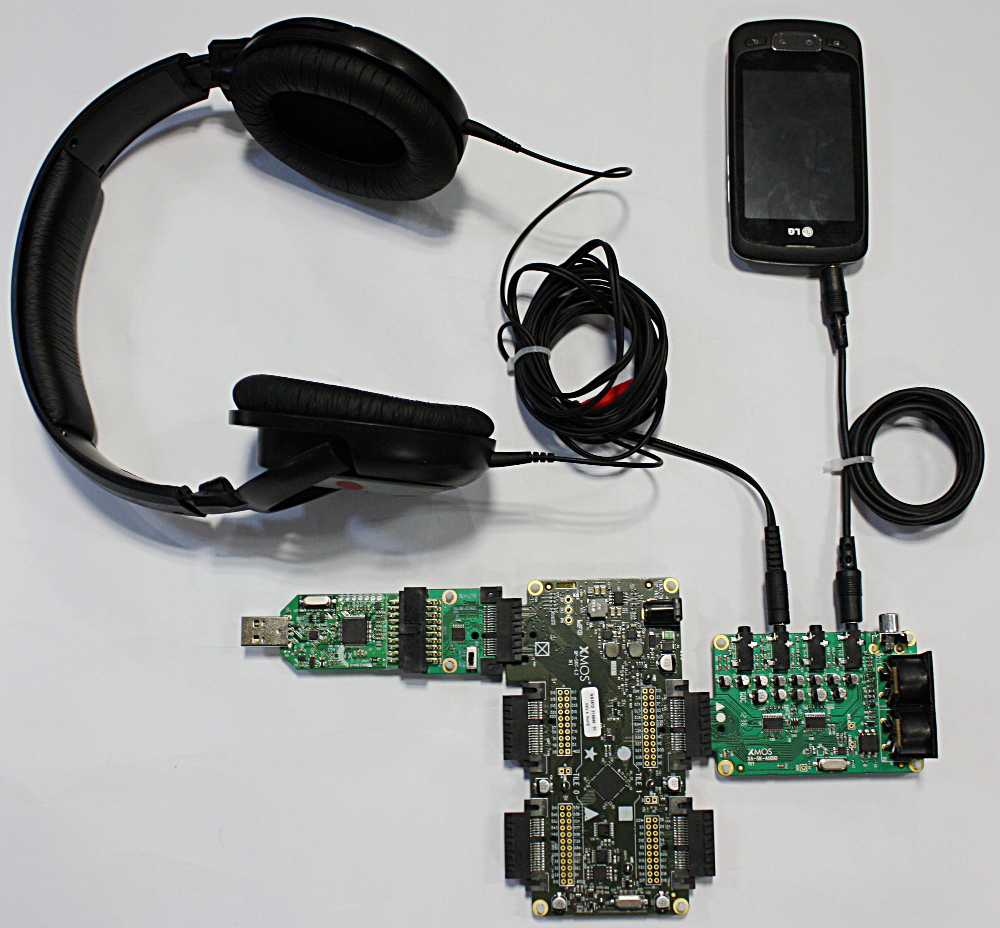

.. _slicekit_biquad_filter_Quickstart:

This document covers the setup and execution of various demonstrations of real time audio processing. They all require the XA-SK-AUDIO Slice Card, and the last two also need the XA-SK-SDRAM external memory Slice Card.

BiQuad Filter Slicekit Application
----------------------------------

This is a demonstration of a simple audio application that uses a small number of software modules and slice cards, 
to produce an audio equalisation effect.

Hardware Setup
++++++++++++++

The following hardware components are required:

* XP-SKC-L2 (Slicekit L2 Core Board)
* XA-SK-AUDIO (Audio board)
* XA-SK-XTAG2 (Slicekit XTAG adaptor)
* XTAG-2 (XTAG Connector board)

XP-SKC-L2 Slicekit Core board has four slots with edge conectors: ``SQUARE``, ``CIRCLE``, ``TRIANGLE`` and ``STAR``, 
and one chain connector marked with a ``CROSS``.

To setup up the system:

#. Connect the XA-SK-AUDIO Audio board to Slicekit Core board using the connector marked with the ``CIRCLE``.
#. Connect the XTAG Adapter board to Slicekit Core board, using the chain connector marked with a ``CROSS``.
#. Connect XTAG-2 board to the XTAG adapter.
#. Set the ``XMOS LINK`` to ``OFF`` on the XTAG Adapter.
#. Connect the XTAG-2 to host PC with a USB cable (not provided with the Slicekit starter kit).
#. Connect analogue audio source (e.g. microphone) to minijack In_1/2
#. Connect analogue audio monitor (e.g. headphones) to minijack Out_1/2
#. Connect D/C barrel jack of XMOS power supply to Slicekit Core board.
#. Switch on the power supply to the Slicekit Core board.

   Hardware Setup for BiQuad Filter Slicekit Application
   
	
Import and Build the Application
++++++++++++++++++++++++++++++++

1. Open xTIMEcomposer and check that it is operating in online mode. 
   Open the edit perspective (Window->Open Perspective->XMOS Edit).
#. Locate the ``'BiQuad Filter Slicekit Audio Demo'`` item in the xSOFTip pane on the bottom left of the window, 
   and drag it into the Project Explorer window in the xTIMEcomposer. 
   This will also cause the modules on which this application depends to be imported as well. 
   These modules are: module_dsp_biquad, module_dsp_utils, module_i2s_master and module_i2c_single_port.
#. Click on the app_slicekit_biquad item in the Explorer pane then click on the build icon (hammer) in xTIMEcomposer. 
   Check the console window to verify that the application has built successfully. 

For help in using xTIMEcomposer, try the xTIMEcomposer tutorial, that can be found by selecting Help->Tutorials from the xTIMEcomposer menu.

Note that the Developer Column in the xTIMEcomposer on the right hand side of your screen 
provides information on the xSOFTip components you are using. 
Select the module_dsp_biquad component in the Project Explorer, and you will see its description together with API documentation. 
Having done this, click the `back` icon until you return to this quickstart guide within the Developer Column.

Run the Application
+++++++++++++++++++

Now that the application has been compiled, the next step is to run it on the Slicekit Core Board using the tools 
to load the application over JTAG (via the XTAG2 and Xtag Adaptor card) into the xCORE multicore microcontroller.

#. Supply some analogue audio to the audio board (via mini jack In_1/2) by connecting a PC or phone audio output. Now try playing the XMOS introductory video found `here <http://www.xmos.com>`_. Alternatively connect and speak into a microphone if you have one.
#. Monitor the analogue audio from the audio board (via mini jack Out_1/2) by connecting some headphones, or sending the audio to an active speaker.
#. Click on the ``Run`` icon (the white arrow in the green circle). After a 1 or 2 seconds filtered audio should be heard.
   The output switches between effect and dry signals about every 8 seconds, so the listener can compare the 2 modes.
   The effect itself cycles through the following 4 filter types: [ LO_PASS, HI_PASS, BAND_PASS, BAND_STOP ]. The currently 
   active effect is displayed in the debug console window.

    
Look at the Code
++++++++++++++++

Now that the application has been run with the default settings, you could try and adjust the filter configuration parameters. 
Such as the 'significant frequency' (e.g. cut-off frequency) and 'quality factor' (e.g. resonance).
Note well, some combinations may produce overload (clipping distortion), in which case turn down the input volume.

#. Examine the application code. In xTIMEcomposer, navigate to the ``src`` directory under app_slicekit_biquad 
   and double click on the ``main.xc`` file within it. The file will open in the central editor window.
#. Find the ``main.xc`` file and note that main() runs 2 cores (processes) in parallel. 
   These are distributed over the tiles available on the Slicekit Core board.
#. Find the app_global.h header. At the top are the tile definitions.
   Note that on the Slicekit Core Board there are only 2 physical tiles 0 and 1.
   All cores are placed on the same tile (1).
#. Find the dsp_biquad.xc file. The function ``dsp_biquad()`` handles the DSP processing for the biquad filter.
   It communicates with the other parallel core via channel c_dsp.
   Data from these channels is buffered, and the buffers are passed to the ``use_biquad_filter()`` function for processing.
   ``use_biquad_filter()`` and ``config_biquad_filter()`` can be found in directory ``module_dsp_biquad\src``. 
   Finally, there is a finite-state-machine which switches the output between the dry and effect signals.

